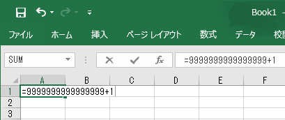
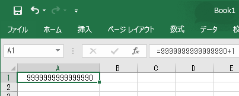
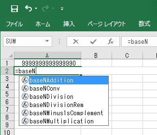
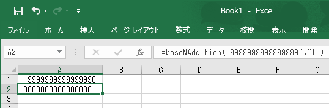
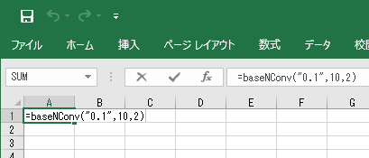
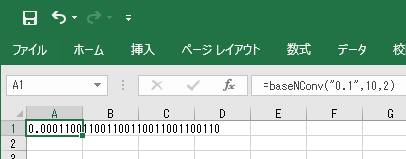

[<- Back](./index.html)

# 使いましょう

このページでは、「BaseNNumericString」を使用した具体例を、使い方を含めて説明しています。  
以下の内容を一通り実践すれば、「BaseNNumericString」を活用できるようになります。

## 9,999,999,999,999,999 + 1 = 9,999,999,999,999,990 !?

例として以下の演算を行ってみましょう。

> 9,999,999,999,999,999 + 1

非常に大きな数に対する足し算ですが、ひっ算で求める分には簡単な計算です。  
+1 なので、すべての桁が繰り上がって答えは、「10,000,000,000,000,000(10京)」です。  

ですがExcelの演算(+)では、以下のようになります。

↓この状態で、Enterを押す

足される数に、「9,999,999,999,999,999」を指定したのに、  
「9,999,999,999,999,990」と変更された上、  
答えが「9,999,999,999,999,990」になってしまいました。  
( +1 さえ、正しく演算してくれません)

「BaseNNumericString」でこの演算を行うには、以下のようにします。

演算結果を表示させたいセルで、「=baseN」と入力してください。  
(※まだEnterは押さないでください)  

すると、baseNから始まる関数の候補が以下画像のようにリストアップされます。

このリストから、「baseNAddition」を選択します。  
※キーボードの上下キーで「baseNAddition」にカーソルをあわせたら、「Tab」キーで選択します。  

次に、()内に、足される数と足す数を以下画像のように指定します。

ここで注意してほしいのは、  
指定している数値を""で括っていることです。  
これは、「9,999,999,999,999,999」という数値を指定するという事ではなく、  
「9999999999999999」という文字列を指定するという事を意味しています。  
(キーボードを叩いている私達からすれば、どちらも同じ事ですが、コンピュータにとって両者は大きな違いがあるのです)  

このような指定の仕方を一般的に「String型で指定する」もしくは、「文字列型で指定する」といいます。  

「BaseNNumericString」のAPI仕様では、String型で指定する必要がある引数については、  
パラメータの説明に「変数名 - 説明(String型)」と記載しています。  
使用する関数の引数がString型である必要がるのかどうかを判断するには、  
API仕様を参照すれば判断できます。  

最後に、Enterを押します。

正しい答えである、  
「10,000,000,000,000,000(10京)」を得る事ができました。  

上記の説明では、関数の引数に直接、""で括った数値を指定しましたが、  
Excel標準の関数同様、セルのアドレスを指定する事も可能です。  
(しかし、足される数として入力したい他のセルに、  
「9,999,999,999,999,999」を入力しても、そのセルの値は「9,999,999,999,999,990」に変更されてしまいます。  
これはExcelの仕様ですので、セルの書式を「文字列」に変更して、「9999999999999999」と入力してください。)  

## 2進数の 1,000,000,000 - 0.1

次の例として、以下の演算を行ってみましょう

> 2進数における、  
> 1,000,000,000 - 0.1

今回も引かれる数は10億というなかなか大きな数ですが、ひっ算で求める分には簡単な計算です。  
-0.1 なので、すべての桁が繰り下がって答えは「111,111,111.1」です。  

ですがこの演算は、Excel標準機能では簡単には解決できません。  

なぜなら、  
「2進数の四則演算をするときは、2進数→10進数に変換してから演算する必要がある。  
しかし、取り扱える2進数は 自然数で、なおかつ、0～111,111,111(10進数でいう、0～511) まで」  
という制約があるからです。

「BaseNNumericString」なら、以下のように指定すれば簡単です。

使用する関数は、1つ目の例で使用した、「baseNAddition」である事は変わりません。  
四則演算における減算は、マイナス値による和算に等しいからです。  

そのため、第2引数には、"-0.1"というマイナス値を指定します。  
さらに、1つ目の例では使用しなかった、第3引数を指定します。  
この例では2進数による演算をしたいので、2 を指定しています。  

最後に、Enterを押します。

正しい答えである、  
「111,111,111.1」を得る事ができました。  
この例では、10進数の演算のときには省略していた第3引数に、「基数を2とする」という意味で、 2 を指定しました。  

このように、場合によって省略可能な引数が、「BaseNNumericString」には存在します。  

「BaseNNumericString」のAPI仕様では、省略可能な引数については、  
パラメータの説明に「変数名 - 説明(Optional)」と記載しています。  
使用する関数の引数が省略可能かどうかを判断するには、API仕様を参照すれば判断できます。  

## 10進数の 0.1 を 2進数に変換

最後の例として、基数変換を行ってみましょう

> 10進数の、  
> 0.1  
> を、  
> 2進数に変換

Excelの標準機能が取り扱える2進数は、  
「自然数で、なおかつ、0～111,111,111(10進数でいう、0～511) まで」ですから、  
この問題もまた、Excel標準機能で解決するには難題です。  

「BaseNNumericString」なら、以下のように指定すれば簡単です。

使用する関数を「baseNConv」にして、  
第1引数に変換対象の数値、  
第2引数に変換前の基数  
第3引数に変換後の基数を指定します。  
Enterを押すと、以下画像のようになります。

真の解は、数学的に表すと、以下のように導かれます。

10進数の10は、2進数で1010だから、  
10進数の$$0.1\left(=\frac{1}{10}\right)$$は、2進数では、  

$$
\begin{align}
&\frac{1}{1010}&\\
&&\hookleftarrow\times1.1\\
=&\frac{1.1}{1111}&\\
\end{align}
$$

解をAとすると、  

$$
\begin{align}
\frac{1.1}{1111}&=A\\
1.1&=1111A\\
1.1&=10000A-A
\end{align}
$$

これは、$$A=0.0\dot{0}01\dot{1}$$ のときに成り立つ。  
その為、10進数の 0.1 は、2進数では$$0.0\dot{0}01\dot{1}$$

ですので「baseNConv」関数は、上の画像のように表示されている桁数まで(数えると、30桁まで表示されています)なら、正しい解が得られた事になります。  
30桁以上の精度が必要な場合は、以下のように指定します。

第1～第3引数までは今までのままにして、第4引数に 60 を指定しました。  
Enterを押すと、以下のようになります。

2つ目の例同様、この関数にも省略可能な引数が存在し、  
「baseNConv」においてそれは、求める小数点以下の桁数となります。  
詳細な仕様はAPI仕様に記載しています。  

以上が、「BaseNNumericString」の基本的な使い方です。  
提供する関数は「baseNAddition」「baseNConv」だけではありません。  
各関数の仕様は、API仕様を参照して下さい。  

[<- Back](./index.html)
